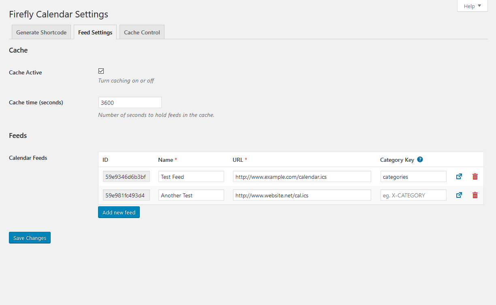
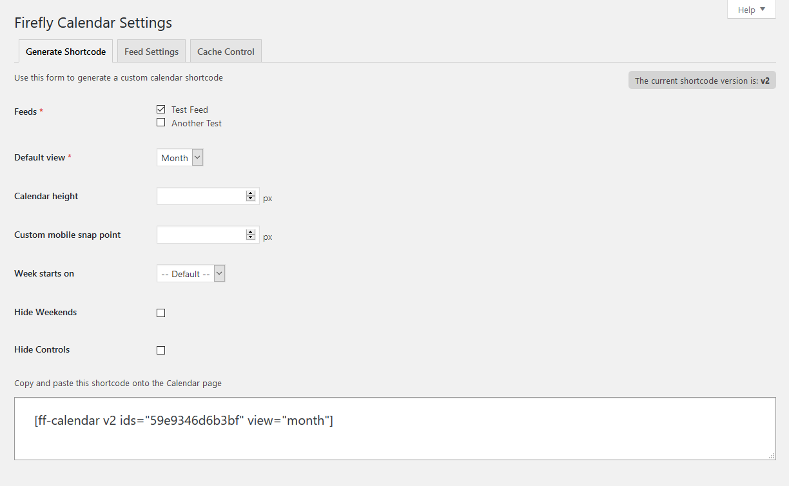
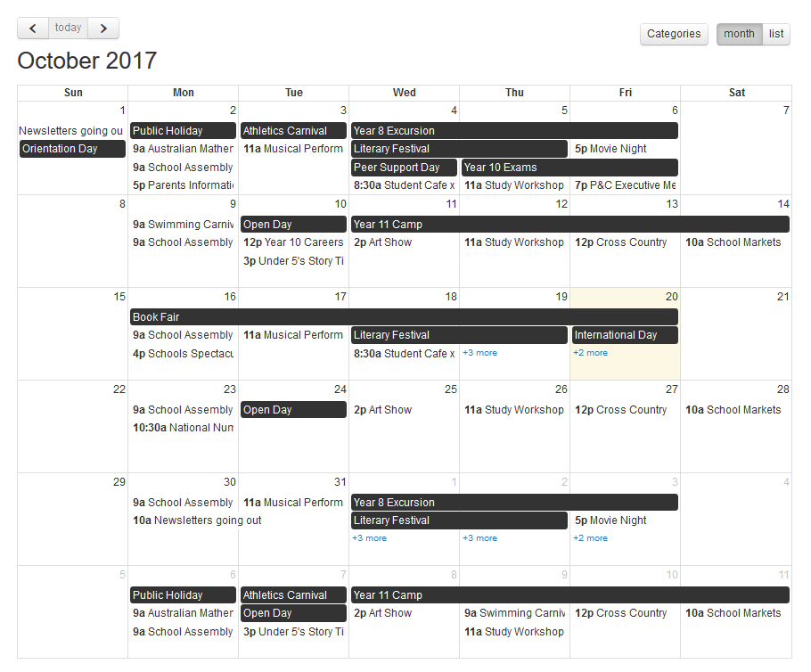

=== Firefly Calendar ===
Contributors: Firefly Interactive
Donate link: http://www.fi.net.au
Tags: calendar, events, ics, feeds
Requires at least: 4.6
Tested up to: 6.1.2
Stable tag: 6.1.2
License: GPLv2 or later
License URI: http://www.gnu.org/licenses/gpl-2.0.html

Firefly Calendar takes ICS feed URLs and transforms them into calendars.

# Description

Firefly Calendar takes ICS feed URLs and transforms them into calendars.

Calendars can be inserted onto any page via a shortcode, or any widget area via the Firefly Calendar Widget.

Calendars can display multiple feeds together in the same view and can be configured to display as categories for filtering.

Calendar data can also be access via REST API with the following routes
| Route 																			| Description 										|
| ---																				| ---												|
| http://yoursite.com/wp-json/ff-calendar/v1/all 									| all calendar data	separated by feed ID			|
| http://yoursite.com/wp-json/ff-calendar/v1/feeds/									| all feed config arrays separated by feed ID		|
| http://yoursite.com/wp-json/ff-calendar/v1/feeds/{id}								| a feed config array 								|
| http://yoursite.com/wp-json/ff-calendar/v1/events/								| all events from all feeds	(merged)				|
| http://yoursite.com/wp-json/ff-calendar/v1/events/days/{num} [1]		| all events from all feeds (merged) limited to {num} days from start date	|
| http://yoursite.com/wp-json/ff-calendar/v1/events/limit/{num} [2]		| all events from all feeds (merged) limited to the next {num} events from start date	|
| http://yoursite.com/wp-json/ff-calendar/v1/events/{id,id,id...}							| all events from a specified set of feeds						|
| http://yoursite.com/wp-json/ff-calendar/v1/events/{id,id,id...}/days/{num} [1]	| all events from a specified set of feeds limited to {num} days from start date 	|
| http://yoursite.com/wp-json/ff-calendar/v1/events/{id,id,id...}/limit/{num} [2]	| all events from a specified set of feeds limited to the next {num} events from start date		|
| http://yoursite.com/wp-json/ff-calendar/v1/categories/							| all categories in use by all feeds				|
| http://yoursite.com/wp-json/ff-calendar/v1/categories/{id,id,id...}						| all categories in use by specified feed IDs					|

[1]: This route supports the `start_date` parameter to modify the first date to count days from (defaults to today). eg. `?start_date=1970-01-01` 
[2]: This route supports the `start_date` parameter to modify the first date to count events from (defaults to today) and the `offset` parameter to step through the events - useful for pagination (defaults to 0). eg. `?start_date=1970-01-01&offset=2` 

# Installation

1. Upload `ff-calendar` to the `/wp-content/plugins/` directory
2. Activate the plugin through the 'Plugins' menu in WordPress
3. Access Firefly Calendar settings to add your feeds

# Frequently Asked Questions

* **How do I split my events into categories?**
	If your ICS feed contains categories (most don't, so double check), you can use the optional _Category Key_ field on the Feed Settings tab to specify which ICS component to use as a category. If you do not know which ICS component contains your categories, you will need to inspect your ICS feed manually to find out[1]. Download the .ics file and open in a plain text editor to see the raw data. Take note of the component that holds the event category and paste this value in the _Category Key_ field.

	[1]: This is an advanced functionality and best handled by someone familiar with the ICS format.

* **My ICS feed does not have categories!**
	If your ICS feed does not contain categories, you can recreate the functionality using multiple feeds. Set up multiple feeds and leave the Category Key fields blank. The Calendar will instead of the feed _Name_ as a category.

* **Do I need to turn on the cache?**
	It's recommended to turn it on. Turning it off will result in MUCH slower page load speeds.

* **I've created a new event but it isn't showing up in the calendar!**
	It's probably caught in the cache. The best thing to do is wait for it to refresh itself. You can check the cache TTL (Time To Live) in the _Cache Control_ tab for an indication on how long you'll need to wait. You can empty the cache manually to force the feed to refresh, but be warned that this will result in longer than normal load times for a while as the cache regenerates.

# Screenshots

## Feed Settings Page

## Generate Shortcode Page

## Front-end render

# Changelog

### 2.7
* Update iCalCreator library
* Update PHPFastCache libary
* Fix cache key

### 2.6.4
* PHP 8.2 compatibility

### 2.6.3
* PHP 8.0 compatibility

### 2.6.2
* Remove FontAwesome

### 2.6.1
* PHP 7.4 compatibility - fix warnings from curly braces used for string position access (e.g. str{0})

### 2.6
* WordPress 5.5.x compatibility - permission callbacks on REST routes

### 2.5.5
* Increase timeout for wp_remote_get from 5 to 30 seconds - some calendar files take too long to retrieve

### 2.5.4
* Fix calendar not rendering properly in IE11

### 2.5.3
* Prevent shortcode render when no IDs have been selected in widget

### 2.5.2
* Fix events with the all-day flag showing incorrect end dates in details pop-up

### 2.5.1
* Fix errors appearing when creating a widget with no feeds selected
* Fix bug on Upcoming view/limited feeds with events with `false` dates never expiring

### 2.5.0
* Output events in REST in correct timezone according to WordPress setting
* Remove time on all-day events (necessary to do timezone conversions)
* Fix bug with events that lack an end date
* Fix bug with all-day recurring events not being set as all-day
* Clean up code and improve documentation

### 2.4.3
* Remove accidentally left var_dump causing REST output to break

### 2.4.2
* Add millisecond timestamp start/end dates ("start_ms" and "end_ms") to the REST data output

### 2.4.1
* Bug fix - REST route now returns numeric keyed array when limiting by days

### 2.4
* v1 shortcode support permanently removed from front end render
* Allow (formerly) single feed rest routes to specify a comma delimited list of ids
* Render calendar on two REST calls - one for relevant data and one for categories (rather than one call per category/feed)
* Cache a hash of merged data for multiple ids

### 2.3.0
* Added wrapper class to help differentiate between calendars on widgets and pages
* Fixed single-feed rest routes not limiting/offsetting events properly

### 2.2.0
* Fixed calendar widget not displaying (bug caused by previous version 2.1.1)

### 2.1.1
* Fixed bug where shortcode would always render calendar at the top of the page
* Updated categories modal to use multiple columns on desktop and added a scrollbar if content too long

### 2.1.0
* Update ICalCreator library
* Tweaks to data loader and send back WP_Error on bad load/parse
* Categories may be sent back as ARRAY or STRING

### 2.0.2
* Remove link markup on cache listing page
* Remove unnecessary dual cache (pre and post parse). Cache only post parse since raw data is never referenced.
* Alter cache key to ID + name for easier visual cross-reference and to remove ambiguity with the previous URL key format
* Add additional caching for potentially expensive operations like creating merged/sorted events array which forms the basis for other operations

### 2.0.1
* added more descriptive error handling on rest routes
* added ability to set `start_date` and `offset` to rest routes that limit event data
* changed generic `events` rest route to merge feeds together by default (even if not limiting)
* update documentation on rest routes in README

### 2.0.0
* Updated options page to make adding feeds more user-friendly
* Added the ability to specify categories in each feed
* Each feed is now assigned a unique ID on save to make referencing easier
* Updated shortcode format to send through feed IDs rather than index/names. New shortcodes include a "v2" attribute.
* Feed data is now expressed via REST API routes instead of custom JSON templates
* Updated front-end calendar render to make turning on/off categories smoother (no longer requires a reload)
* Added support for backwards-compatiblility with v1.7 and below so that plugin doesn't break on upgrade. These safe-guards will be removed in a future version.
* Added a help menu to the options page
* Fleshed out README file
* Bug fixes and code cleaning

### 1.7
* PHP 7 compatibility (updated iCalcreator)
* Updated cache engine dependencies

### 1.6.3
* Fix issue where flattening the event sources into one events array (for the purpose of limiting events in upcoming view) caused category checkboxes not to function as expected.
* Uncheck category tick boxes for inactive data sources

### 1.6.2
* Fixed cache time being set incorrectly - now reflects the same TTL as set on the options page

### 1.6.1
* moved uninstall method to /uninstall.php

### 1.6
* add namespace to the ExceptionThrower class - resolve conflict with Midgard plugin
* refactor include names/paths
* pass plugin name/version to sub-classes to bust cache with plugin updates

### 1.5.7
* Remove updater code - use external group updater instead (better network support)

### 1.5.6
* fixed issue with calendar not working when not defining an event/day limit (introduced in last version)

### 1.5.5
* fixed issue with event/day limits being applied per feed rather than per calendar

### 1.5.4
* removed fixed height on month list view

### 1.5.3
* added a link and link text field to the widget

### 1.5.2
* reworked recurrence date calculation to account for all-day and timed events

### 1.5.1
* updated the look of the current feeds on the advanced settings page
* fixed newline characters showing up in event descriptions

### 1.5
* Allow multiple feed selections in widget

### 1.4
* Add auto update server

### 1.3.7
* fixed issue with Upcoming view not correctly showing x number of events/days if they span across months
* fixed issue with Upcoming view not correctly displaying events that span multiple days
* fixed issue with Upcoming view that caused recurring events to repeat multiple times per day
* fixed event detail modal throwing error when no end time is available

### 1.3.6
* added methods to clean up plugin on deactivation and uninstall
* fixed unexpected output warning on plugin activation

### 1.3.5
* fixed incorrect date/time display caused by not converting to the local timezone. Dates now correct to timezone set in device settings.

### 1.3.4
* added filename parameter to vcalendar config to support feeds where filename is required

### 1.3.3
* added checks to settings page to not display certain sections if no feeds have been imported
* added automatic flushing of rewrite rules on plugin activation

### 1.3.2
* changed classname added in 1.3.1 to avoid clashing with theme styles
* changed modal positioning and modal header size so they are not reliant on theme CSS

### 1.3.1
* added classname to event detail modal to allow styling modals from different feeds
* renamed options page menu title

### 1.3
* fixed Linux issues caused by references to iCalcreator
* added Cache Control options page
* updated shortcode generator to allow for copy/pasting shortcode into Visual view
* fixed categories modal that broke in v1.1
* fixed class name formatting for feed names with three or more words

### 1.2
* Removed Upcoming view from toolbar (still accessible by setting as default view)
* Edited loading screen and toolbar header styles
* Edited Upcoming view default styles
* Removed hard-coded Font Awesome icons. Now added via CSS.

### 1.1
* Removed reliance on jQuery Modal due to clashing with other modal scripts (ie. Bootstrap)
* Implemented custom CSS modal
* Reworked /public/js/calendar-render.js file to be more human-readable

### 1.0
* Release

# Upgrade Notice

= 2.0.0 =
* Major (possibly breaking) changes. Back up feed and widget settings before updating.

= 1.0 =
* Release
